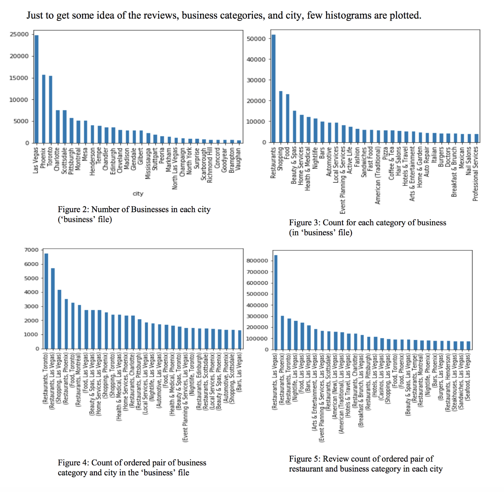
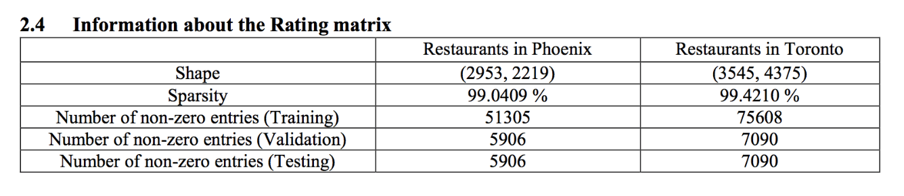

# Yelp-Recommendation-System
Download Yelp's Business.CSV and Review.CSV to run this code on your machine. Code along with the output can be viewed in .ipynb file

## Winner of “Best First Year Project” award at NYU CDS Academy Awards.

- Built a recommendation engine for recommending restaurants to Yelp users using traditional models like Cosine similarity based model,
SVD and Alternating Least Square model; Rating Matrix was very sparse with sparsity of 99.4%
- Developed advanced models like Stochastic Gradient Descent - based model, Neural Network based model, Random Forest Regressor
based model and an ensemble model to achieve higher performance on the sparse rating matrix completion task

## Sparsity of Dataset is high

